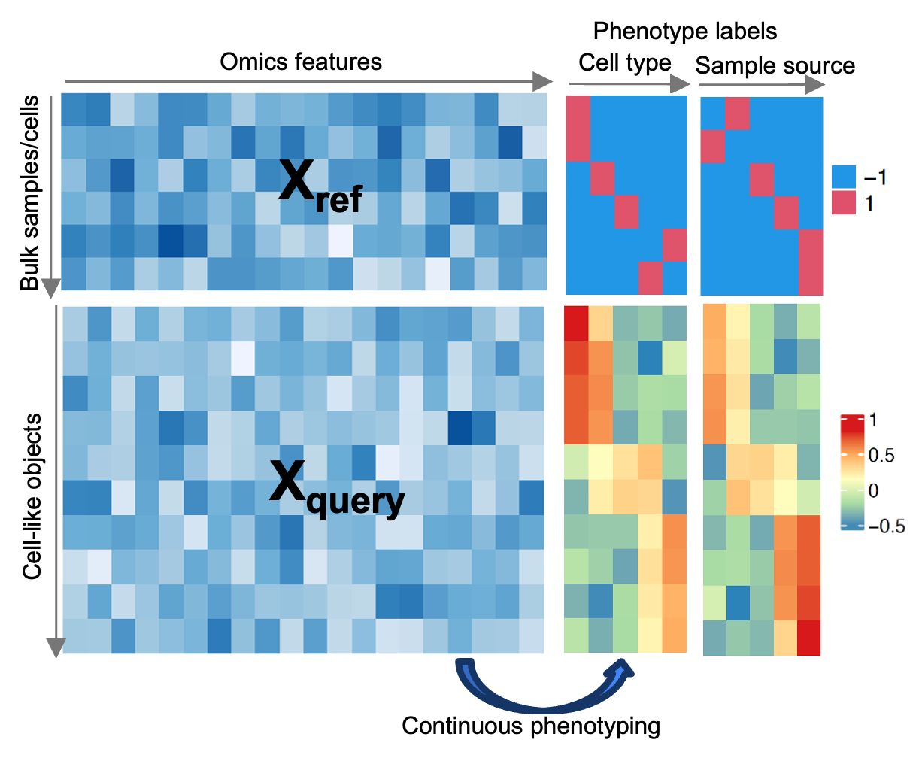
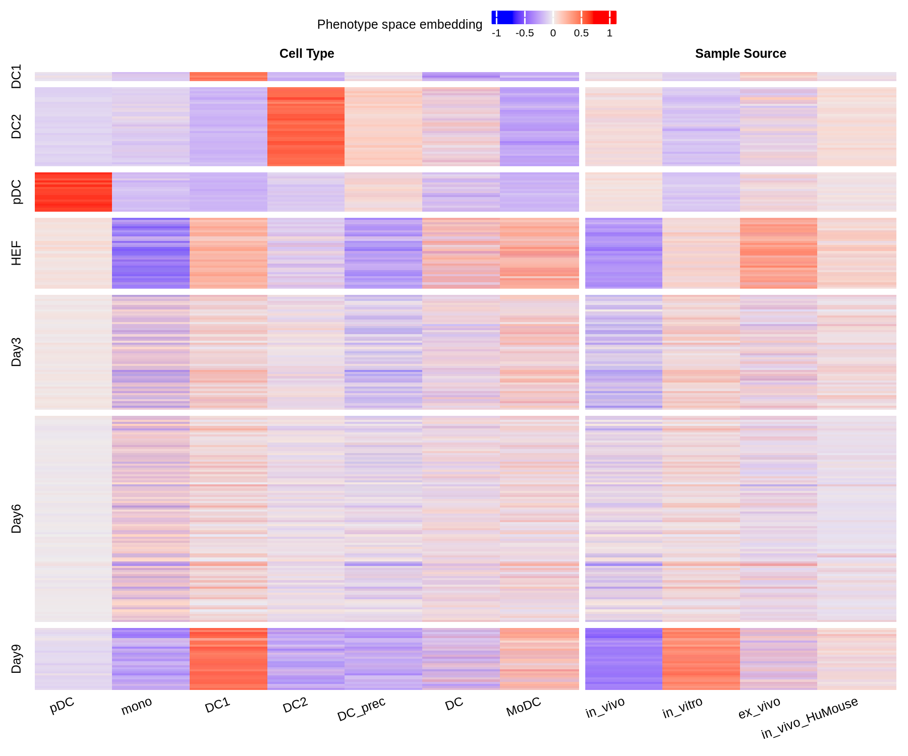

# Φ-Space: Continuous phenotyping for single-cell and spatial multiomics data.

Mao, Jiadong, Deng, Yidi and Lê Cao, Kim-Anh. (2024). Φ-Space: Continuous phenotyping of single-cell multi-omics data. *bioRxiv*.

Check out our talk and bioRxiv manuscript at [mixOmics website](http://mixomics.org/2024/06/phispace/).

For more case studies on spatial transcriptomics data, see our [poster](https://github.com/jiadongm/PhiSpace/blob/main/PhiSpace_poster_CBA.pdf).

## Installation

Installing BioConductor dependencies:
``` r
if(!requireNamespace("BiocManager", quietly = TRUE)) {
  install.packages("BiocManager")
}
BiocManager::install(c("SingleCellExperiment", "scran", "scuttle", "ComplexHeatmap"))
```

Install the GitHub version of PhiSpace:
``` r
if(!requireNamespace("devtools", quietly = TRUE)) {
  install.packages("devtools")
}
devtools::install_github('jiadongm/PhiSpace/pkg')
```


## What is Φ-Space?

Φ-Space ([Mao et al., 2024](https://www.biorxiv.org/content/10.1101/2024.06.19.599787v1)) is a computational framework for reference-based continuous annotation of single-cell and spatial multiomics data. Given a bulk or single-cell RNA-seq **reference** dataset with potentially multiple layers of phenotypes defined in the metadata (e.g. cell type and sample source), Φ-Space can phenotype on a continuum the cells and cell-like objects in the **query** dataset. The core of Φ-Space is continuous phenotyping based on partial least squares (PLS) regression. Compared to conventional cell type annotation methods, Φ-Space has the following strengths:

- Identifying continuous and out-of-reference cell states;
- Robust against batch effects;
- Utilising bulk and multiomic refereneces and queries;
- More suitable for exploring the spatial patterns of rare cell types. 




We have applied Φ-Space to many different use cases, including

| Reference     |      Query    | Note   |
| :------ |    :------   | :------  |
| bulk RNA-seq  |   scRNA-seq   |   |
| scRNA-seq     |   scRNA-seq   |  |
| scRNA-seq     |   scATAC-seq  | requires a bimodal bridge dataset |
| CITE-seq (scRNA+Protein-seq)  |  CITE-seq   | using both modalities |
| scRNA-seq    |   subcellular spatial transcriptomics | e.g. Stereo-seq, CosMx, 10x Xenium |
| scRNA-seq    |   supercellular spatial transcriptomics | e.g. 10x Visium, Slide-seqV2 |


## Example: transitional identities of induced dendritic cells (DCs)

We illustrate how Φ-Space works using the first case study in our [manuscript](https://www.biorxiv.org/content/10.1101/2024.06.19.599787v1).

- Reference bulk RNA-seq: [Stemformatics DC atlas](https://journals.aai.org/jimmunol/article/209/12/2352/237295/The-Human-Dendritic-Cell-Atlas-An-Integrated)
- Query scRNA-seq: [Rosa et al. (2018)](https://www.science.org/doi/10.1126/sciimmunol.aau4292) 

Dendritic cells (DCs) are a type of immune cells. DCs are relatively rare in human blood samples. Hence it is desirable to culture *in vivo* like 
DCs using *in vitro* methods. Rosa et al. (2018) claimed that they successfully reprogrammed human esophagus fibroblasts (HEFs) into induced DCs after 9 days *in vitro* cell culturing. 

The Stemformatics DC atlas is a bulk RNA-seq atlas of different subtypes of human DC samples (FACs sorted). The DC atlas contains 


### Read data

Load packages
``` r
suppressPackageStartupMessages(library(PhiSpace))
suppressPackageStartupMessages(library(ggplot2))
suppressPackageStartupMessages(library(dplyr))
suppressPackageStartupMessages(library(magrittr))
suppressPackageStartupMessages(library(ggpubr))
suppressPackageStartupMessages(library(tidyr))
suppressPackageStartupMessages(library(RColorBrewer))
suppressPackageStartupMessages(library(ComplexHeatmap))
```

Download the processed reference dataset [ref_dc.rds](https://unimelbcloud-my.sharepoint.com/:u:/g/personal/jiadong_mao_unimelb_edu_au/EZVy-qceLC5Ik9YQ9yiASM8BRy0eKn4KYj_fy5A8LVdifA?e=NhIuTt) and the processed and downsampled query dataset [query_Rosa_sub.rds](https://unimelbcloud-my.sharepoint.com/:u:/g/personal/jiadong_mao_unimelb_edu_au/Eep7PpTnTHJIirmK8EM6JGsBRrxRlx_Soqk5DT-8KiheNQ?e=MvFzNA). In addtion, we download the selected genes [ref_dc_feat.rds](https://unimelbcloud-my.sharepoint.com/:u:/g/personal/jiadong_mao_unimelb_edu_au/EYW4m1WMtxhNg9vTUFQdZAQB12sF0VOj3u2pmz3Uce5U6A?e=zdyv2a). See our [manuscript](https://www.biorxiv.org/content/10.1101/2024.06.19.599787v1) for a description of feature selection. 

``` r
dat_dir <- "/data/projects/punim0613/JiaDong/PhiSpace/" # replace this by your own directory where you store ref_dc.rds and query_dc.rds
query <- readRDS(paste0(dat_dir, "query_Rosa_sub.rds"))
reference <- readRDS(paste0(dat_dir,"ref_dc.rds"))
selectedFeat <- readRDS(paste0(dat_dir, "ref_dc_test.rds"))

# Rank normalise reference and query
query <- RankTransf(query, "counts")
reference <- RankTransf(reference, "data", sparse = F)

# Customised colour code
DC_cols <- c(
  `DC precursor` = "#B3B3B3",DC_prec = "#FFFFB3",
  MoDC = "#CCEBC5", cDC1 = "#1B9E77", 
  cDC2 = "#D95F02",`dendritic cell` = "#B3B3B3", 
  DC = "#B3DE69", monocyte = "#B3B3B3",
  mono = "#80B1D3",`plasmacytoid dendritic cell` = "#7570B3",
  DC1 = "#1B9E77",DC2 = "#D95F02",
  pDC = "#7570B3",HEF = "#FEE5D9", 
  Day3 = "#FCAE91",Day6 = "#FB6A4A",
  Day9_SP = "#DE2D26", Day9_DP = "#A50F15",
  Day9 = "#A50F15",other = "#B3B3B3"
)

DC_cols_source <- c(
  ex_vivo = "#B3B3B3",in_vitro = "#A50026",
  in_vivo = "#313695",`in_vivo_HuMouse` = "#80B1D3", query = "#B3B3B3"
)

DC_symbs <- c(
  query = 4, reference = 16
)
```

In the above code, we applied rank transform to both reference and query. This is because the rank transform is more appropriate for this particular reference dataset ([Elahi et al., 2022](https://journals.aai.org/jimmunol/article/209/12/2352/237295/The-Human-Dendritic-Cell-Atlas-An-Integrated)). In general, normalisation methods should be chosen to suit individual cases. The only requirement is that both reference and query are normalised in the same way. **No** additional harmonisation of reference and query is needed.


### Continuous phenotyping

Now we are ready to apply PhiSpace to continuously phenotype the query cells. 
``` r
PhiSpaceAssay <- "rank"
phenotypes <- c("Cell Type", "Sample Source")
PhiMethod <- "PLS"

query <- PhiSpace(
    reference, 
    query,
    ncomp = 30,
    selectedFeat = selectedFeat,
    phenotypes = phenotypes, 
    PhiSpaceAssay = PhiSpaceAssay,
    regMethod = PhiMethod,
    scale = FALSE
  )
```

### Visualise annotation

Draw the PhiSpace scores as heatmap.
``` r
PhiScores_norm <- reducedDim(query, "PhiSpace")

queryLabs <- query$mainTypes
queryLabs[queryLabs %in% c("Day9_SP", "Day9_DP")] <- "Day9"
lvls <- c("DC1", "DC2", "pDC", "HEF", "Day3", "Day6", "Day9")
p <- plotPhiSpaceHeatMap(
  PhiSpaceScore = PhiScores_norm,
  reference = reference,
  phenotypes = phenotypes,
  queryLabs = queryLabs, 
  queryLvls = lvls,
  column_names_rot = 20,
  name = "Phenotype space embedding",
  row_names_gp = gpar(fontsize = 6),
  column_names_gp = gpar(fontsize = 6),
  show_row_dend = F,
  show_column_dend = T,
  # row_title = row_title, 
  row_title_gp = gpar(fontsize = 6),
  column_title_gp = gpar(fontsize = 6, fontface = "bold"),
  heatmap_legend_param = list(
    title_position = "leftcenter",
    title_gp = gpar(fontsize = 6),
    grid_height = unit(2, "mm"),
    grid_width = unit(2, "mm"),
    labels_gp = gpar(fontsize = 5),
    legend_direction = "horizontal"
  )
) 

draw(
  p, heatmap_legend_side = "top"
)
```



Every column of the heatmap corresponds to a phenotype defined in the bulk reference. Every horizontal line of the heatmap represents a query cell. The query cells are grouped according to their cell types:

- Control cell types: DC1 (type 1 conventional DC), DC2 (type 2 conventional DC) and pDC (plasmacytoid DC). These cell types are *in vivo* DC subtypes;
- HEF: the starting point of DC reprogramming;
- Day3, Day6, Day9: HEFs after 3, 6 and 9 days of reprogramming.

We can see that the control cell types were predicted to have strong DC1, DC2 and pDC identities. In terms of sample source, they are more *in vivo* like than *in vitro*. HEFs have an ambiguous identity since they were not defined in the reference. However, after 9 days of reprogramming, the HEFs were clearly more DC1-like, with strong *in vitro* identity.


## Downstream analyses

The essence of Φ-Space is the so-called **phenotype space analysis**. That is, we view cell type prediction as dimension reduction. How is it dimension reduction? Look at the heatmap: each cell was represented by the gene expression level of thousands of genes, and now they are represented by 11 dimensions, each measuring their likelihood of belonging to a certain phenotype defined in the reference. We term this new representation of cells their **phenotype space embedding**.

As any other dimension reduction objects, we can use cells' phenotype space embedding for downstream analyses. One of such analyses is phenotype space PCA, which allows us to visualize both bulk samples and single cells in the same space.

``` r
d
```


