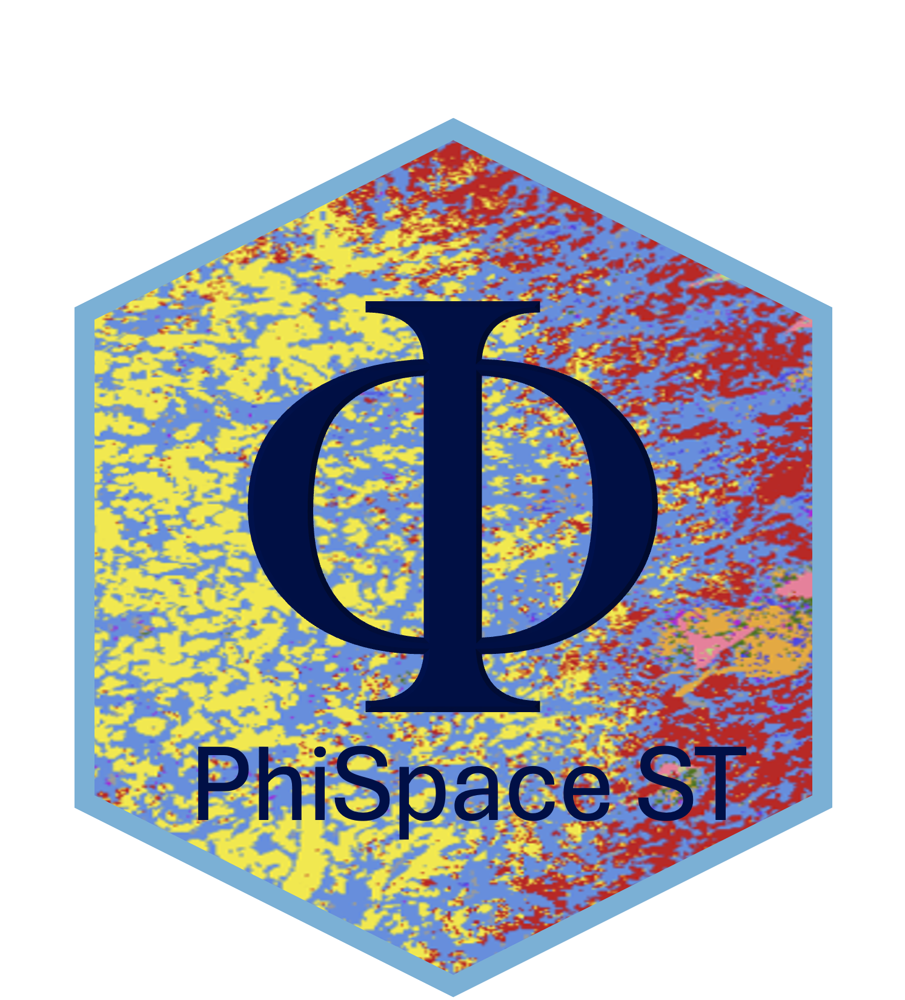

# Φ-Space: Continuous phenotyping of single-cell and spatial omics data.


<p float="left">
   
  
</p>


## Vignettes

[PhiSpace pkgdown site](https://jiadongm.github.io/PhiSpace/) 

[A workflow for spatial transcriptomics featuring SpaNorm, PhiSpace and jazzPanda](https://github.com/bhuvad/CosMxSpatialAnalysisWorkshop)


## Installation


``` r
if(!requireNamespace("BiocManager", quietly = TRUE)) {
  install.packages("BiocManager")
}
BiocManager::install('jiadongm/PhiSpace/pkg')
```


## Citing PhiSpace

Mao, Jiadong, Choi, Jarny and Lê Cao, Kim-Anh. (2026). Φ-Space ST: a platform-agnostic method to identify cell states in spatial transcriptomics studies. *Cell Reports Methods* 6(8), 101483. [doi:10.1016/j.crmeth.2026.101483](https://doi.org/10.1016/j.crmeth.2026.101483).

Mao, Jiadong, Deng, Yidi and Lê Cao, Kim-Anh. (2025). Φ-Space: continuous phenotyping of single-cell multi-omics data. *Genome Biology* 26, 323. [doi:10.1186/s13059-025-03755-8](https://doi.org/10.1186/s13059-025-03755-8).


