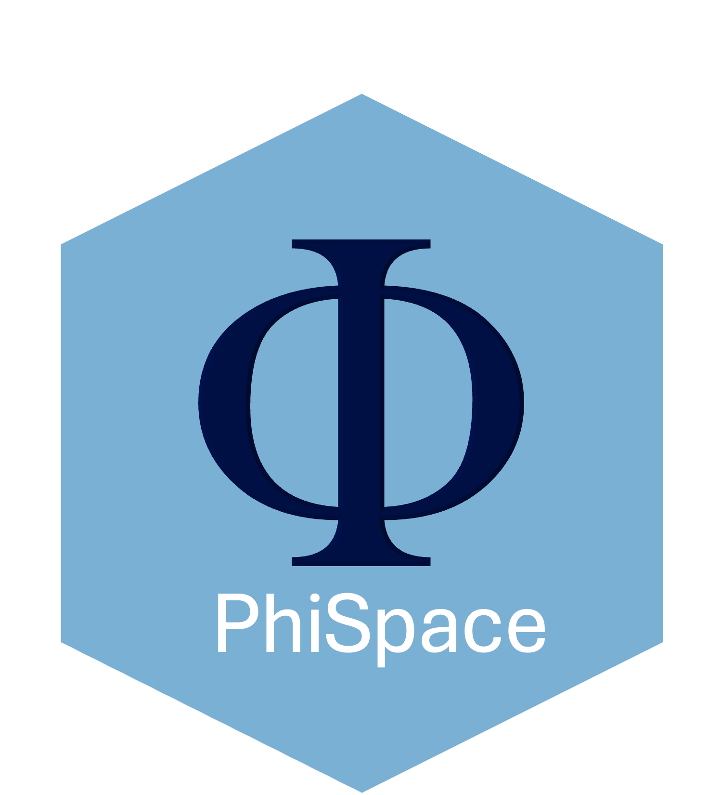

# Φ-Space: Continuous phenotyping of single-cell and spatial omics data.


<p float="left">
   
  
</p>


## Vignettes

[PhiSpace pkgdown site](https://jiadongm.github.io/PhiSpace/) 

[A workflow for spatial transcriptomics featuring SpaNorm, PhiSpace and jazzPanda](https://github.com/bhuvad/CosMxSpatialAnalysisWorkshop)


## Installation


``` r
if(!requireNamespace("BiocManager", quietly = TRUE)) {
  install.packages("BiocManager")
}
BiocManager::install('jiadongm/PhiSpace/pkg')
```


## Citing PhiSpace

Mao, Jiadong, Choi, Jarny and Lê Cao, Kim-Anh. (2025). Φ-Space ST: a platform-agnostic method to identify cell states in spatial transcriptomics studies. [*bioRxiv*](https://www.biorxiv.org/content/10.1101/2025.02.05.636735v1).

Mao, Jiadong, Deng, Yidi and Lê Cao, Kim-Anh. (2025). Φ-Space: Continuous phenotyping of single-cell multi-omics data. [*Genome Biology*](https://genomebiology.biomedcentral.com/articles/10.1186/s13059-025-03755-8).

## Other resources

Check out our talk for PhiSpace single-cell multiomics at [mixOmics website](http://mixomics.org/2024/06/phispace/).


